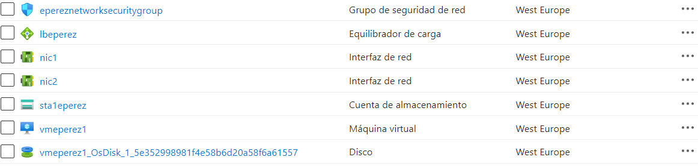
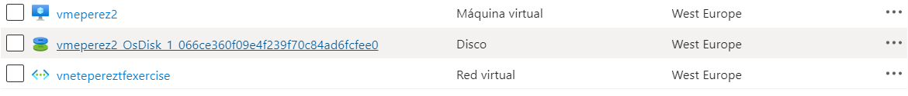

# Ejercicio semanal Terraform

### Creación de módulos 

Se han creado los módulos:

- networkgroup: para crear el grupo de seguridad
- vnet: para crear la virtual net

Cada uno de los módulos está estructurado siguiendo la estructura estándar: 

$ tree minimal-module/
.
├── README.md
├── main.tf
├── variables.tf
├── outputs.tf

- En el archivo ``main.tf`` se definen los recursos
- En el archivo ``variables.tf`` se definen las variables 
- En el archivo ``outputs.tf`` se definen los outputs

### LLamamiento de módulos

En la raíz de la carpeta ``modulo-weekly-exercise`` se llama a los módulos anteriores para hacer uso de ellos y además se añaden los recursos necesarios para la creación de una subred, la asociación del grupo de seguridad con la subred, la creación de dos máquinas virtuales y un balanceador de carga.

Para dicho llamamiento se utiliza el atributo ``source`` con el path del módulo y se hace de forma local.

En la definición de variables tanto de las máquinas virtuales como de las interfaces de red se ha hecho uso de colecciones ``map`` para poder crear varias a la vez haciendo un llamamiento del map con el bucle for_each.

Para obtener los valores de los ids de las interfaces de red (necesarios en el recurso de MVs) se han utilizado las claves del mapa.

### Tfstate

Se ha añadido la configuración del backend para almacenar el ´´tfstate`` en Azure Blob Storage, 


### Workload

Se añade un workload como ejemplo de uso. En este caso se utiliza el módulo llamándolo de forma remota y pasándole las variables.

Los valores de las variables se definen en el archivo ``terraform.tfvars``

Para el ejemplo de uso se han utilizado: 
- Grupo de recursos: " rg1eperez-lab01"
- Cuenta de almacenamiento: "sta1eperez"
- Contenedor: "tfstateeperez"

Para tener listos los recursos se utilizan los los comandos 

```
terraform init
terraform plan
terraform apply
```

Para destruir los recursos se utiliza el comando:

```
terraform destroy
```

### Resultado



